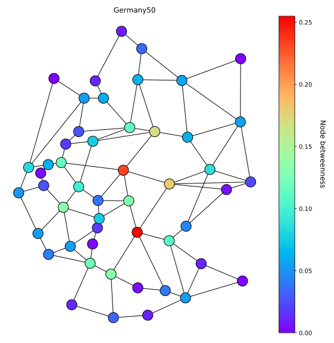
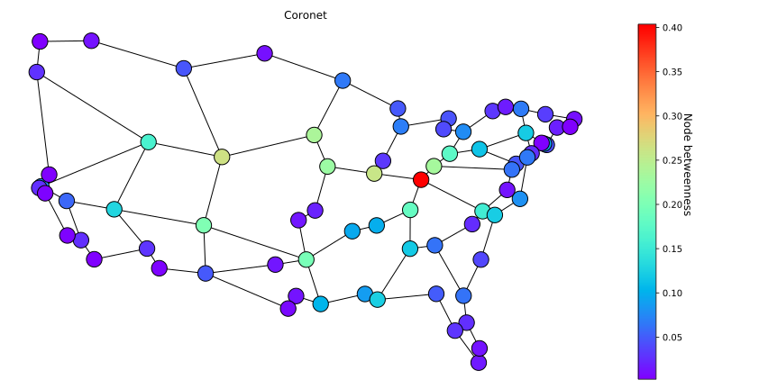
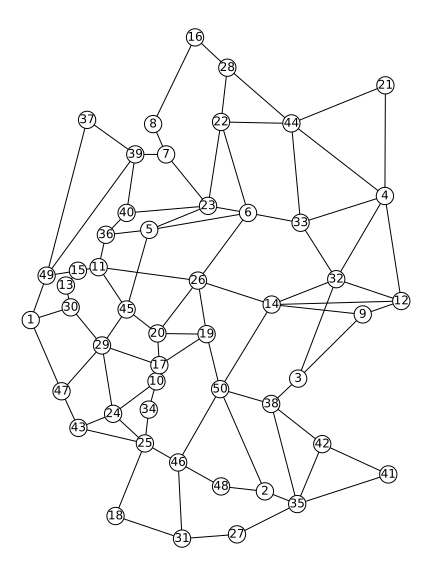
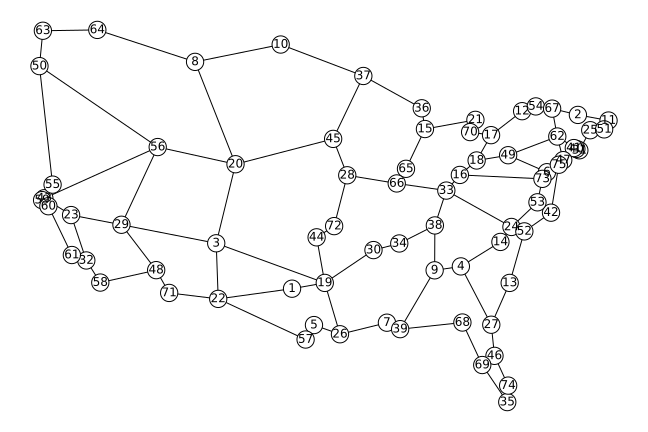

# Structural methods to enhance the resilience of content delivery services to link cut attacks

The code available in this reporitory was presented at the training school of CA15127-RECODIS on Design of Disaster-resilient Communication Networks, hosted in Brussels, Dec. 10-11, 2019.

The course was designed by Marija Furdek and Amaro de Sousa. The code was developed by Carlos Natalino and Igor M. de Araújo.

Germany50             |  Coronet
:-------------------------:|:-------------------------:
  |  

The code in this repository works with Python 3.6.
The code can use either [LPSOLVE](http://lpsolve.sourceforge.net/5.5/) or IBM CPLEX.
The LP files generated using CPLEX can be also used with Gurobi.

## Content in this repository

- File exploring several metrics of the topologies [here](./explore-topologies.ipynb).
- File containing the ACA examples used in the RECODIS school [here](./aca.ipynb).
- File containing the CLSD examples using predefined replica placement [here](./clsd.ipynb).
- File containing the RPP and CLSD examples [here](./rpp-clsd.ipynb).
- Topology description of two topologies:

Germany50             |  Coronet
:-------------------------:|:-------------------------:
  |  

- A Dockerfile for the creation of a container using LPSOLVE and Python to run the examples.

## If you want to use a docker container

*Note that you may need superuser permissions to run docker commands in your computer.*

1. Create and start the container with name `school`:

```
docker build --rm -t school .
```


2. Run the docker container:
```
docker run --name school school
```

## If you have Python, Jupyter and LPSOLVE (or IBM CPLEX) in your computer

1. Download the code:
```
git clone https://github.com/carlosnatalino/recodis-school.git
```

2. Run jupyter:
```
cd recodis-school
jupyter lab
```

### Citing the work

The code contained in this repository was used in the following publications:

- **Average Content Accessibility (ACA)**: C. Natalino, A. Yayimli, L. Wosinska and M. Furdek, "Content accessibility in optical cloud networks under targeted link cuts," 2017 International Conference on Optical Network Design and Modeling (ONDM), Budapest, 2017. DOI: [10.23919/ONDM.2017.7958546](https://doi.org/10.23919/ONDM.2017.7958546).
```
@INPROCEEDINGS{NatalinoEtAl:ACA,
    author={C. {Natalino} and A. {Yayimli} and L. {Wosinska} and M. {Furdek}},
    booktitle={International Conference on Optical Network Design and Modeling (ONDM)},
    title={Content accessibility in optical cloud networks under targeted link cuts},
    year={2017},
    doi={10.23919/ONDM.2017.7958546},
    month={May},
    }
```

- **Mean Content Accessibility ($\mu$-ACA)**: Carlos Natalino, Aysegul Yayimli, Lena Wosinska, Marija Furdek, "Infrastructure upgrade framework for Content Delivery Networks robust to targeted attacks," Optical Switching and Networking, Volume 31, 2019, Pages 202-210. DOI: [10.1016/j.osn.2018.10.006](https://doi.org/10.1016/j.osn.2018.10.006)
```
@article{NatalinoEtAl:muACA,
    title = "Infrastructure upgrade framework for Content Delivery Networks robust to targeted attacks",
    journal = "Optical Switching and Networking",
    volume = "31",
    pages = "202 - 210",
    year = "2019",
    issn = "1573-4277",
    doi = "https://doi.org/10.1016/j.osn.2018.10.006",
    author = "Carlos Natalino and Aysegul Yayimli and Lena Wosinska and Marija Furdek",
    }
```

- **Replica Placement Problem and Critical Link Set Detection**: Carlos Natalino, Amaro de Sousa, Marija Furdek, Lena Wosinska, "Content Placement in 5G-enabled Edge/Core Datacenter Networks Resilient to Link Cut Attacks", Networks. DOI: [10.1002/net.21930](https://doi.org/10.1002/net.21930)

For inquiries, contact carlos.natalino@chalmers.se


